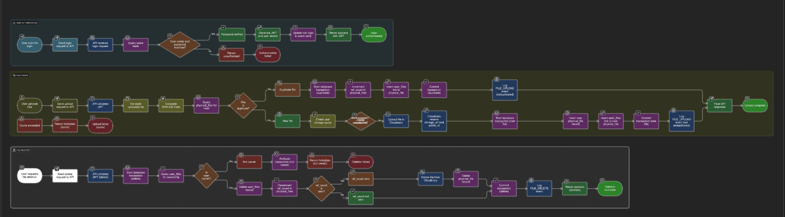

# System Architecture & Design Rationale - KeyVia

This document provides a detailed overview of the architectural decisions, technology choices, and engineering practices employed in the development of the KeyVia Secure File Vault.

## 1. High-Level Architecture

The application is designed as a classic three-tier architecture, separating concerns to ensure scalability, maintainability, and security.

  

1.  **Frontend (Client Tier)**: A modern, responsive **React** single-page application (SPA) that provides the user interface. It is a static build deployed on **Vercel**, which offers a global CDN for fast load times worldwide.
2.  **Backend (Application Tier)**: A stateless RESTful API built in **Go (Golang)**. This API handles all business logic, including user authentication, file processing, and database interactions. It is containerized with **Docker** and deployed on **Render**, allowing for easy horizontal scaling.
3.  **Data Tier**:
    * **Metadata Database**: A **PostgreSQL** database managed by **Supabase** stores all metadata, including user information, file details, sharing permissions, and deduplication references.
    * **File Storage (Blob Storage)**: The actual physical files are stored in **Cloudinary**, a dedicated cloud-based object storage service. This separation is crucial for scalability, as it offloads the heavy lifting of file storage and delivery from the application server.

---

## 2. Technology Stack Rationale

Each component of the tech stack was deliberately chosen to meet the project's requirements for performance, scalability, and developer efficiency.

### Backend: Go (Golang)
Go was selected as the backend language for several key reasons:

* **Performance**: Go is a compiled language renowned for its near-native performance and efficient memory management. This is critical for a file-handling application that needs to process uploads and serve data with minimal latency.
* **Concurrency**: Go's built-in support for concurrency via Goroutines and channels is a major advantage. This was leveraged in the `analyticsHandler`, where multiple database queries are executed concurrently using a `sync.WaitGroup`, significantly reducing the API response time for complex data aggregation.
* **Strong Standard Library**: The powerful standard library (`net/http`, `crypto/sha256`, `encoding/json`) allowed for the implementation of core features like the web server and file hashing without relying heavily on external frameworks, keeping the application lightweight.
* **Static Typing**: Go's static type system helps catch errors at compile time, leading to more robust and maintainable code, which is essential for a production-grade application.

### Database: PostgreSQL (via Supabase)
PostgreSQL was the ideal choice for the relational database due to:

* **Reliability and Data Integrity**: As a mature, ACID-compliant database, PostgreSQL guarantees data integrity through transactions. This was used extensively, for example in the `uploadHandler`, where database inserts and reference count updates are wrapped in a transaction to prevent data corruption if an error occurs.
* **Scalability**: PostgreSQL is known for its ability to handle large volumes of data and high concurrency. The use of indexes (e.g., `physical_files_hash_idx`, `user_files_owner_id_idx`) was a deliberate choice to ensure that queries remain performant as the number of files and users grows.
* **Managed Service (Supabase)**: Choosing Supabase to manage the PostgreSQL instance abstracts away the complexities of database administration, backups, and scaling, allowing for a greater focus on application development. The connection pooling provided by Supabase (`pgbouncer=true` in the `DATABASE_URL`) is critical for managing connections efficiently in a serverless or scaled environment.

### Frontend: React.js
React was chosen for the frontend for its:

* **Component-Based Architecture**: This allows for the creation of reusable UI components (`FileCard`, `UploadModal`, etc.), leading to a more modular, maintainable, and scalable codebase.
* **Rich Ecosystem**: The availability of libraries like `react-router-dom` for navigation and `react-dropzone` for handling drag-and-drop functionality accelerated development.
* **State Management**: Using React's Context API (`AuthContext`, `FileContext`) provided a clean and effective way to manage global application state (like user authentication and file lists) without introducing the complexity of a larger state management library.

---

## 3. In-Depth Backend Design Decisions

### File Deduplication and Storage
The core of the storage system is the intelligent separation of metadata and physical data, which enables efficient deduplication.

* **Content Hashing**: Upon upload (`uploadHandler`), the first action is to calculate the **SHA-256 hash** of the file's content. This hash serves as a unique identifier for the file's content, regardless of its name.
* **Two-Table Schema**:
    1.  `physical_files`: This table stores information about the unique file content. It has a `UNIQUE` constraint on the `hash` column. It also contains the `storage_url` from Cloudinary and a `ref_count`.
    2.  `user_files`: This table acts as a link between a user and a physical file. It contains the `owner_id`, a foreign key to `physical_files`, and the user-given `filename`.
* **Workflow**:
    1.  When a file is uploaded, its hash is calculated.
    2.  The backend queries `physical_files` for this hash.
    3.  **If the hash does not exist**: The file is new. It's uploaded to Cloudinary, a new record is created in `physical_files` with `ref_count = 1`, and a corresponding record is created in `user_files`.
    4.  **If the hash exists**: The file is a duplicate. The file is **not** re-uploaded to Cloudinary. Instead, the `ref_count` in the existing `physical_files` record is incremented, and a new record is simply created in `user_files` pointing to the existing physical file.
* **Deletion**: The `deleteFileHandler` reverses this logic. It deletes the `user_files` record and decrements the `ref_count`. The actual file is only deleted from Cloudinary when `ref_count` becomes zero. This is a critical design choice to prevent accidental data loss for other users who have uploaded the same file.

### Security and Authorization
Security was a primary consideration at every level of the backend design.

* **Password Hashing**: User passwords are never stored in plaintext. The `bcrypt` library is used (`signupHandler`) to generate a strong, salted hash of the password, which is a one-way process. `bcrypt` was chosen over simple hashing algorithms like SHA-256 for passwords because it is deliberately slow, which helps mitigate brute-force attacks.
* **Stateless Authentication with JWT**: The API uses JSON Web Tokens (`github.com/golang-jwt/jwt/v5`) for authentication. This makes the backend **stateless**, which is crucial for scalability. Each server instance can validate a token without needing to query a central session store. The JWT payload includes the `UserID` and `Role`, which are used for authorization decisions in subsequent requests.
* **Middleware Chain**: A layered middleware approach using `gorilla/mux` provides robust security:
    1.  `authMiddleware`: The outermost layer for protected routes. It validates the JWT and injects the authenticated user's details into the request context.
    2.  `rateLimitMiddleware`: This middleware implements per-user rate limiting using `golang.org/x/time/rate`. It prevents abuse by limiting the number of requests a single user can make per second.
    3.  `adminOnlyMiddleware`: A specific authorization middleware that checks the user's role from the JWT payload, ensuring that only users with the `admin` role can access certain endpoints.

### Scalability and Performance
The application was designed with scalability in mind.

* **Connection Pooling**: Instead of creating a new database connection for every request, the backend uses `github.com/jackc/pgx/v5/pgxpool`. A connection pool manages a set of active database connections, which are reused across requests. This dramatically reduces the overhead of establishing connections and is a standard practice for high-performance database applications.
* **Stateless Backend**: As mentioned, the use of JWT makes the API stateless. This means you can run multiple instances of the backend server behind a load balancer, and any instance can serve any user request, allowing for seamless horizontal scaling.
* **Asynchronous Operations**: The `logAuditEvent` function is executed as a Goroutine (`go func()`). This is a deliberate choice because audit logging, while important, is not a critical part of the user-facing request-response cycle. By running it asynchronously, the API can send a response back to the user faster without waiting for the audit log to be written to the database.

---

## 4. Deployment Strategy

The deployment strategy leverages modern PaaS (Platform as a Service) providers to ensure high availability, scalability, and a smooth CI/CD workflow.

* **Frontend (Vercel)**: Vercel is optimized for deploying static frontends like React. It provides automatic deployments on every `git push`, a global CDN to ensure low latency for users anywhere in the world, and automatic SSL.
* **Backend (Render)**: Render was chosen for the Go backend because of its native support for **Docker**. The backend is containerized using the provided `Dockerfile`, which creates a reproducible environment. Render can automatically build and deploy this container from the GitHub repository and supports easy scaling and environment variable management.
* **Database (Supabase)**: Using a managed database provider like Supabase is a key architectural decision. It handles all the complex and critical tasks of database management, including backups, security, and scaling, allowing the developer to focus purely on the application logic.
