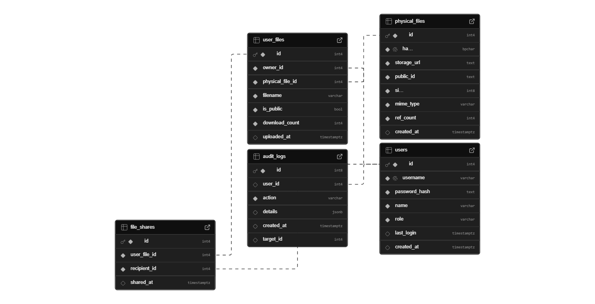

# KeyVia - Secure File Vault & Sharing Platform - by Abhishek Jain

<p align="center">
  
</p>

<p align="center">
  <em>A production-grade, secure file vault system engineered with Go, React, and PostgreSQL. It features efficient, deduplicated storage, powerful search capabilities, and granular file sharing controls, all designed for scalability and a seamless user experience.</em>
  <br/><br/>
  <a href="https://keyvia.vercel.app" target="_blank">
    
  </a>
  &nbsp;
  <a href="https://keyvia-backend.onrender.com/health" target="_blank">
    
  </a>
  &nbsp;
  <a href="https://abhishekjain.vercel.app" target="_blank">
    
  </a>
</p>

---

## 📄 API Documentation (Postman)

A comprehensive, interactive API specification has been meticulously documented using Postman. It details every endpoint, request/response model, and includes multiple examples for success and error cases, providing a clear and professional contract for the API.

<p align="center">
  <a href="https://documenter.getpostman.com/view/39857190/2sB3HtFwWi" target="_blank">
    
  </a>
</p>

---

## ✨ Project Highlights & Features

This project fulfills all core requirements of the capstone task and goes further by implementing several **bonus features** to enhance functionality, security, and user experience.

### Core Features Implemented
* **🗂️ Efficient Storage with Deduplication**: Employs SHA-256 content hashing to ensure that identical files are only stored once, with a reference counting system to manage ownership and deletions. This provides significant storage savings, which are tracked and displayed to the user.
* **🚀 Advanced File Uploads**: A modern, responsive UI supporting single, multiple, and **drag-and-drop** file uploads. The system performs both client-side and server-side MIME type validation to prevent content mismatches.
* **🤝 Powerful Sharing Capabilities**:
    * **Public Sharing**: Generate a public link for any file, making it accessible to anyone.
    * **Private Sharing**: Share files directly and securely with other registered users on the platform.
* **🔍 Advanced Search & Filtering**: A powerful, multi-filter search engine allowing users to query files by filename, MIME type, size range, and date range.
* **📊 Storage Analytics**: A dedicated analytics dashboard for users to visualize their storage usage, including a clear breakdown of savings achieved through deduplication.
* **🖥️ Admin Panel**: An administrative dashboard providing a system-wide view of all files, user details, and download statistics.

### 🏆 Bonus Features & Enhancements
* **☁️ Full Cloud Deployment**: The entire application stack is deployed on modern cloud infrastructure: **Vercel** for the frontend, **Render** for the backend Go API, and **Supabase** for the PostgreSQL database.
* **🔐 Role-Based Access Control (RBAC)**: A robust RBAC system is implemented, distinguishing between `user` and `admin` roles to secure administrative endpoints.
* **📜 Comprehensive Audit Logs**: The system records all critical file activities (upload, download, share, delete), providing a complete audit trail for user actions.
* **📄 In-Browser PDF Previews**: Users can preview `.pdf` files directly within the application, enhancing convenience and workflow.
* **📈 Real-Time Upload Progress**: The frontend provides a visual progress bar during uploads, offering a superior user experience.

---

## 🛠️ Tech Stack & Architecture

The architecture is designed for scalability and maintainability, leveraging a modern, production-ready tech stack.

| Category      | Technology                                                                                                                                                                                                                                                                              |
| :------------ | :-------------------------------------------------------------------------------------------------------------------------------------------------------------------------------------------------------------------------------------------------------------------------------------- |
| **Backend** |  <br/> Chosen for its high performance, concurrency, and static typing, making it ideal for building a fast and reliable backend API.                               |
| **Frontend** |  <br/> Selected for its component-based architecture and vast ecosystem, enabling a modern, fully responsive, and maintainable user interface.                                    |
| **Database** |  <br/> A powerful relational database managed via **Supabase**, chosen for its reliability and robust support for data integrity.                                    |
| **Deployment**|    <br/> Fully containerized with Docker for consistent local development and deployed globally. |

A detailed write-up on the system design and architectural decisions is available here: **[ARCHITECTURE.md](ARCHITECTURE.md)**

---

## 📦 Database Schema

The database is structured to support the application's features efficiently, with a clear separation between user file metadata and the physical, deduplicated file records.

*The complete schema and migration files are version-controlled and located in the `/supabase/migrations` directory.*

<p align="center">
  
  <em>Entity-Relationship Diagram of the KeyVia Database</em>
</p>

---

## 🚀 Getting Started: Local Development

The entire application stack can be run locally with a single command using Docker Compose.

### Prerequisites

* [Go (v1.20+)](https://go.dev/doc/install)
* [Node.js (v18+)](https://nodejs.org/en/)
* [Docker](https://www.docker.com/products/docker-desktop/) & [Docker Compose](https://docs.docker.com/compose/install/)

### 1. Clone the Repository

```bash
git clone [https://github.com/Abhishekkjainn/BalkanID-Task.git](https://github.com/Abhishekkjainn/BalkanID-Task.git)
cd BalkanID-Task
````

### 2\. Configure Environment Variables

Create `.env` files for both the backend and frontend by copying the provided `.env.example` files.

**Backend (`backend/.env`):**

```bash
cp backend/.env.example backend/.env
```

Update `backend/.env` with your local PostgreSQL connection string and a unique JWT secret.

**Frontend (`frontend/keyvia/.env`):**

```bash
cp frontend/keyvia/.env.example frontend/keyvia/.env
```

The `VITE_API_BASE_URL` is already configured for local development.

### 3\. Run with Docker Compose

From the **root directory** of the project, run the following command to build and start all services:

```bash
docker-compose up --build
```

The services will be available at:

  * **Frontend (React App)**: `http://localhost:5173`
  * **Backend (Go API)**: `http://localhost:8080`

-----
